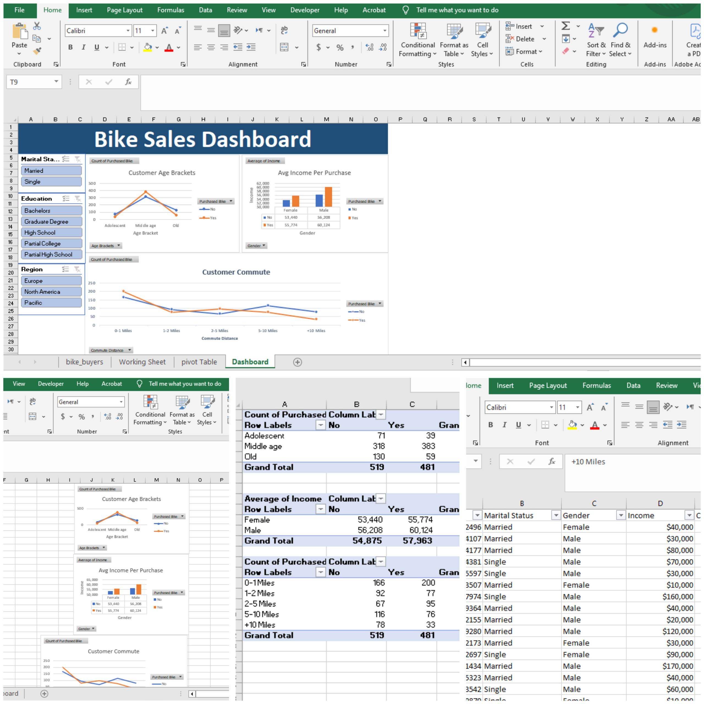
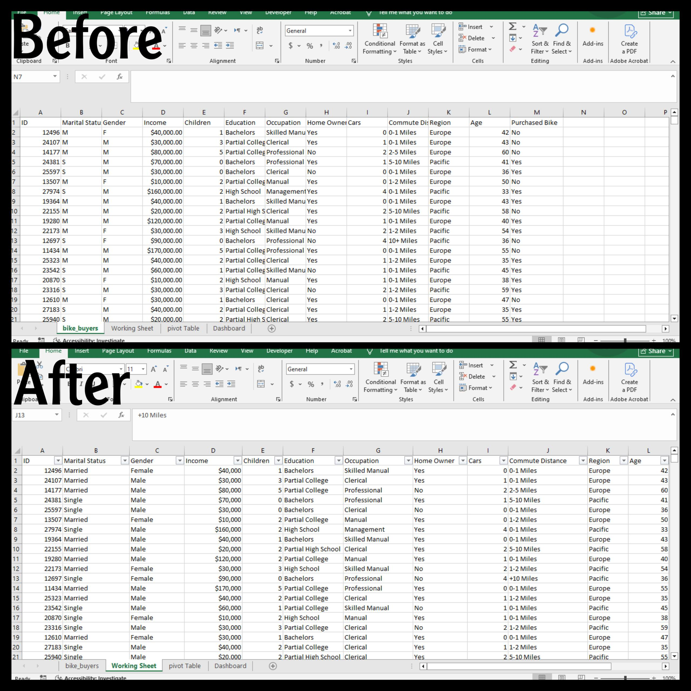
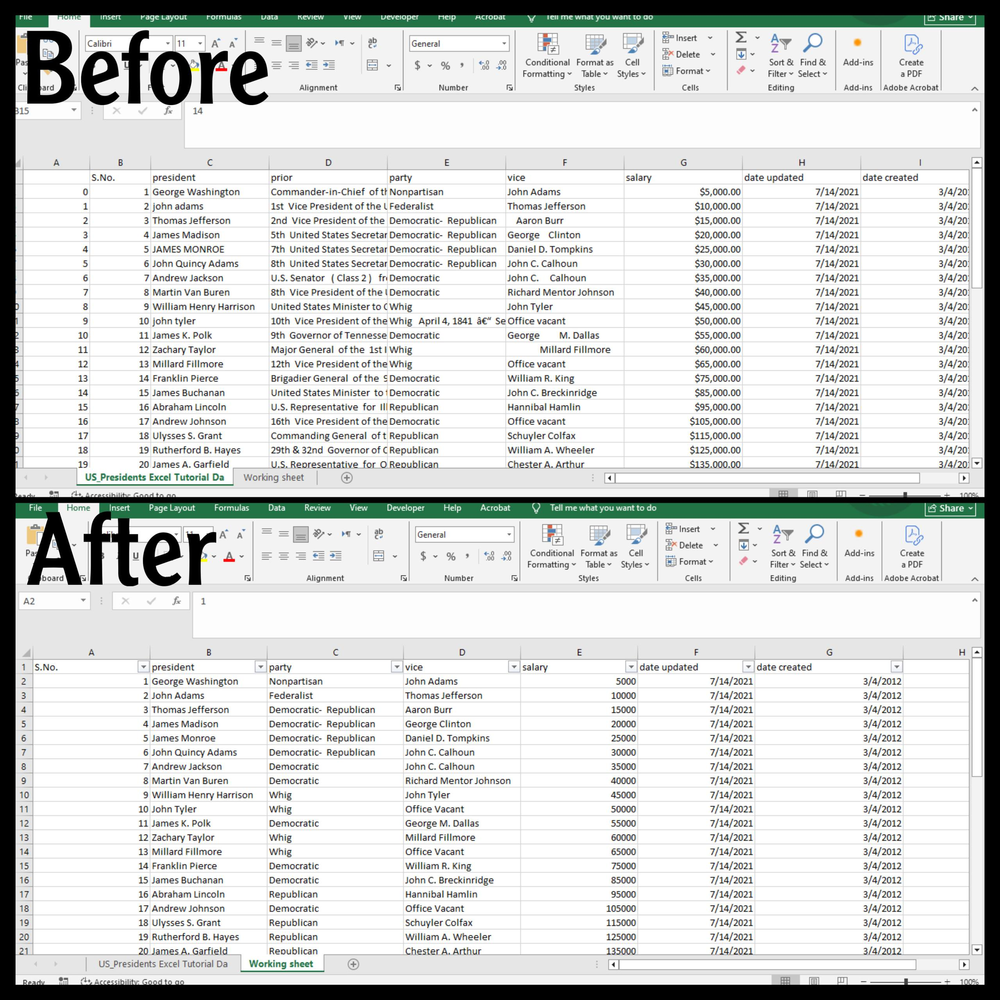

# 📁 Excel Portfolio Projects

## 📋 Overview
-  A collection of small Excel projects demonstrating data cleaning, preparation, and analysis skills.

## 🛠 Tools Used
- Excel (Pivot Tables, Charts, Formulas, Functions)

## 📂 Projects Included
- 🚴 Bike Sales Dashboard (Excel)
- 🧹 Data Cleaning in Excel

---

## 🚴 Bike Sales Dashboard (Excel)

 -  An interactive Excel dashboard analyzing bike sales data to uncover purchasing patterns, customer demographics, and regional performance.

 ### 🛠 Tools Used
- Excel  
- Pivot Tables  
- Charts & Slicers  
- Conditional Formatting

### 🎯 Objectives
- Identify the top-selling bike categories  
- Understand customer trends by age and income  
- Visualize sales performance across regions

### 📸 Dashboard Preview

### 🏆 Key Insights
- Middle-aged customers generated the highest sales.  
- Higher income correlated with higher purchase frequency.  

### 📂 Files
- https://github.com/Muna5abdullah/PortfolioProjects/blob/main/Bike%20Sales%20Dashboard%20Project.xlsx
- https://github.com/Muna5abdullah/PortfolioProjects/blob/main/Bike%20Sales%20Dashboard.jpg

---

## 🧹 Data Cleaning in Excel

This project focuses on cleaning and preparing raw data using Microsoft Excel to ensure consistency, accuracy, and readiness for analysis.

### 🛠 Tools Used
- Excel formulas and functions  
- Conditional Formatting  
- Data Validation

### 🔧 Cleaning Steps Performed
- Removed duplicates  
- Fixed inconsistent capitalization using PROPER()  
- Trimmed extra spaces using TRIM()  
- Standardized date formats  
- Checked for missing or invalid values

### 📸 Example Screenshot

### 🏆 Key Outcome
The final cleaned dataset is ready for dashboard creation or further analysis.

### 📂 Files
- https://github.com/Muna5abdullah/PortfolioProjects/blob/main/Data%20Cleaning%20In%20Excel.xlsx
---
